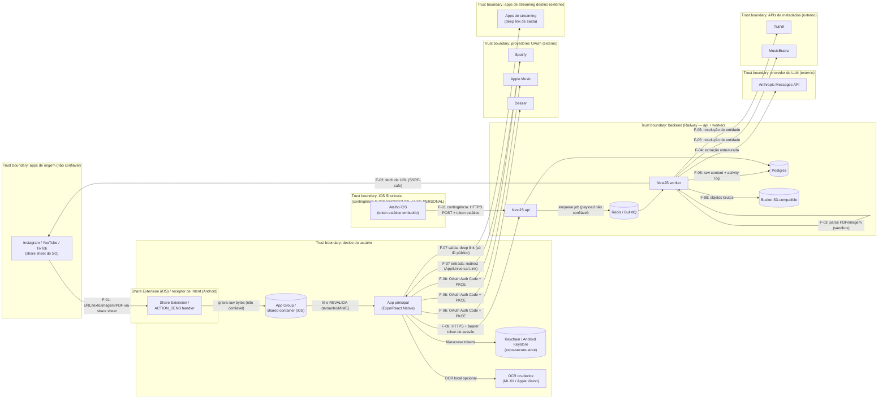

# Threat Model de Segurança — Fase 0 — Fruiqo

Agente: `security-threat-modeler`. Data de referência: **2026-09-27**.

## Método e premissas

- Esta análise é baseada em design/documentação (OWASP MASVS v2 / MASTG, OWASP ASVS v4.0.3, OWASP API Security Top 10 2023, OWASP LLM Top 10, OAuth 2.0 Security Best Current Practice — RFC 9700, RFC 6749, RFC 7636 PKCE, RFC 8252 OAuth for Native Apps, documentação oficial Apple/Android/Anthropic, LGPD). Nenhum teste ativo foi executado contra sistemas de terceiros.
- A **stack candidata** descrita em `docs/fase0-stack-mobile.md` (Expo/React Native + `expo-share-intent` com App Groups no iOS, NestJS `api`+`worker` no Railway, BullMQ/Redis, Postgres, bucket S3-compatible, Anthropic API só no backend, Expo Notifications) é usada aqui **apenas como hipótese de trabalho** para concretizar trust boundaries e controles verificáveis. Este relatório **não aprova nem escolhe** essa stack — isso é papel do `phase0-arbiter`.
- Fontes de entrada: `docs/phase0/platforms.md` (escopo/cenários), `docs/phase0/integration-feasibility.md` (fluxos de auth/deep link/share confirmados, incluindo a seção 7 "Veredito da stack mobile" e a pendência 11 sobre a Share Extension iOS ainda não verificada em host macOS/Linux), `docs/phase0/tos-report.md` (restrições contratuais que geram `TOS-REQ-*`, referenciadas aqui quando têm dimensão de segurança/privacidade).
- Regra fail-closed: todo controle tem critério de verificação concreto. Controle sem verificação clara vira `GAP`, não `SEC-CTRL`. Entrada não validada é rejeitada por padrão (nunca "melhor esforço").
- Inclui o fluxo de contingência **P-IOS-SHORTCUTS** (Atalho iOS com POST autenticado, só `SC-PERSONAL`), conforme `integration-feasibility.md` §2 e §7.

---

## 1. Diagrama de fluxo de dados

Notas do diagrama:
- Toda seta que cruza um trust boundary carrega dado **não confiável até prova em contrário** (share sheet, resposta HTTP de URL arbitrária, arquivo PDF/imagem, resposta do LLM antes de validação de schema).
- O App Group é boundary interno ao device (extensão ↔ app principal), mas o conteúdo que passa por ele já veio de fora (app de origem) — por isso o app principal revalida, não confia apenas por ter vindo "do próprio app".
- P-IOS-SHORTCUTS é um trust boundary à parte porque o segredo (token) vive num objeto do SO (Atalho) fora do controle do app e potencialmente sincronizado via iCloud — ver seção 4/5.

---

## 2. Tabela de ameaças (STRIDE)

| Threat ID | Fluxo | Categoria STRIDE | Descrição | Probabilidade | Impacto | Severidade | Controles (SEC-CTRL) |
|---|---|---|---|---|---|---|---|
| T-01 | F-01 | Tampering / DoS | Arquivo/payload malicioso ou superdimensionado recebido via share sheet trava o app/extensão ou corrompe o hand-off pelo App Group | Média | Média | Média | 01, 02, 03, 29 |
| T-02 | F-01 | Denial of Service | Share Extension iOS excede o limite de memória do processo de extensão (estimativa empírica ~120–180MB, não documentada oficialmente) processando conteúdo grande, sendo encerrada pelo SO | Média | Baixa | Baixa | 01, 02 |
| T-03 | F-01 | Spoofing/Info Disclosure | Erro de configuração do App Group (entitlement incorreto) expõe o container compartilhado a outro app/target | Baixa | Média | Baixa | 28 |
| T-04 | F-02 | Spoofing/Tampering (SSRF) | Backend busca URL fornecida pelo usuário; atacante aponta para IP interno, `169.254.169.254` (metadata de cloud) ou usa redirect para burlar allowlist | Média | Alta (pivô de rede, roubo de credencial de infraestrutura) | **Crítica** | 04 (ver também GAP-01) |
| T-05 | F-02 | Denial of Service | URL compartilhada aponta para resposta extremamente lenta/grande, esgotando threads/memória do worker de fetch | Média | Média | Média | 04 |
| T-06 | F-02 | Information Disclosure | Erro de SSRF vaza corpo de resposta interna (ex.: página de admin interno) em mensagem de erro ao usuário/log | Média | Média | Média | 04, 23 |
| T-07 | F-03 | Denial of Service | PDF/imagem malformada ou decompression bomb (zip bomb em PDF, "image bomb" de pixels) esgota CPU/memória do worker | Média | Alta | Alta | 05, 06, 36 |
| T-08 | F-03 | Tampering (RCE) | Arquivo malicioso explora vulnerabilidade conhecida/0-day de biblioteca de parsing de PDF/imagem, obtendo execução de código no worker | Baixa | Crítica (comprometimento do backend) | **Crítica** | 05, 06, 36 |
| T-09 | F-04 | Tampering | Prompt injection embutido na legenda/texto OCR/PDF tenta manipular a extração estruturada do LLM (instruções disfarçadas de conteúdo) | Alta | Média (mitigada pela ausência de tools e validação de schema) | Alta | 07, 08, 09 |
| T-10 | F-04 | Elevation of Privilege | Se uma futura versão adicionar tool-calling ao LLM, conteúdo injetado poderia disparar ações não pretendidas (ex.: adicionar à playlist sem confirmação) | Baixa (hoje não há tools) | Alta | Média | 08 (restrição de design a manter) |
| T-11 | F-04 | Information Disclosure | Conteúdo compartilhado pode conter dado pessoal de terceiro incidental (pessoa citada/marcada) enviado à Anthropic (processador externo) sem base legal/aviso claros | Alta | Média (regulatório/LGPD) | Alta | 38 (ver GAP-02) |
| T-12 | F-05 | Tampering | Saída manipulada do LLM gera termo de busca malicioso/absurdo enviado à TMDB/MusicBrainz | Média | Baixa | Baixa | 09, 10 |
| T-13 | F-05 | Denial of Service (custo) | Flood de compartilhamentos por um único usuário (acidental ou malicioso) esgota cota diária de API paga/gratuita (TMDB, YouTube Data API, Anthropic) para todos os usuários | Média | Média | Média | 10, 37 |
| T-14 | F-06 | Spoofing | `state` ausente/previsível permite CSRF de login OAuth, vinculando conta de streaming do atacante à sessão da vítima (ou vice-versa) | Média | Alta | Alta | 13 |
| T-15 | F-06 | Tampering | Interceptação do redirect OAuth por outro app instalado que reivindica o mesmo custom URI scheme (mais comum em Android) | Média | Alta (tomada de conta de streaming) | Alta | 12, 14 |
| T-16 | F-06 | Information Disclosure | Token de acesso/refresh armazenado em texto puro (AsyncStorage, log, backup de device) e extraído | Média | Alta | Alta | 16, 23, 25 |
| T-17 | F-06 | Elevation of Privilege | Escopos OAuth mais amplos que o necessário ampliam o dano em caso de vazamento de token | Baixa | Média | Baixa | 18 |
| T-18 | F-06 | Repudiation/Tampering | Ausência de rotação de refresh token permite uso indefinido de um token vazado sem detecção | Baixa | Alta | Média | 17 (ver GAP-03) |
| T-19 | F-07 | Tampering/Spoofing | Deep link de entrada (callback OAuth ou link interno) sequestrado por app malicioso via intent-filter/scheme não verificado | Média | Alta | Alta | 14, 26 |
| T-20 | F-07 | Information Disclosure | Deep link de saída carrega token de sessão/OAuth ou PII na query string, exposto em histórico/logs/analytics de terceiros | Baixa | Alta | Média | 27 |
| T-21 | F-07 | Tampering | Deep link de entrada malformado/parâmetros inesperados causa crash ou navegação para estado inconsistente | Média | Baixa | Baixa | 26 |
| T-22 | F-08 | Information Disclosure | Conteúdo bruto/activity log armazenado sem criptografia em repouso ou exposto via bucket/URL pré-assinada mal configurada | Média | Alta | Alta | 22, 24 |
| T-23 | F-08 | Information Disclosure | Token, segredo ou conteúdo bruto/PII aparece em logs de aplicação/observabilidade (ex.: Sentry) acessíveis a mais pessoas/serviços que o necessário | Alta | Alta | **Crítica** | 23 |
| T-24 | F-08 | Repudiation | Acesso interno/admin ao conteúdo bruto de um usuário não deixa trilha auditável, dificultando detectar uso indevido interno | Baixa | Média | Baixa | 39 (MVP: Não — ver GAP-06) |
| T-25 | F-09 | Spoofing | Token de sessão do Fruiqo vazado/roubado é usado a partir de outro device sem detecção | Média | Média | Média | 19, 40 (ver GAP-04) |
| T-26 | F-09 | Tampering/Elevation (BOLA) | Endpoint de sync aceita `user_id`/recurso do cliente sem revalidar contra a sessão autenticada, permitindo acesso cruzado a dado de outro usuário | Média | Alta | Alta | 20, 21 |
| T-27 | P-IOS-SHORTCUTS | Information Disclosure/Spoofing | Token estático embutido no Atalho é sincronizado via iCloud e/ou exportado/compartilhado acidentalmente pelo usuário, expondo credencial de longa duração | Média | Alta | Alta | 31, 32, 33 |
| T-28 | P-IOS-SHORTCUTS | Elevation of Privilege | Se o token usado no Atalho for o mesmo token de sessão completo (não escopado), seu vazamento dá acesso total à conta (ler histórico, excluir conta), não só criar compartilhamentos | Média | Crítica | **Crítica** | 31 (ver GAP-05 — condicional) |
| T-29 | SC-STORE (transversal a F-08/F-09) | Tampering/Elevation (multi-tenancy) | Falha de isolamento entre tenants expõe conteúdo/tokens/histórico de um usuário a outro em produção com N usuários | Baixa (se controles ativos) | Crítica | Alta | 20, 21 |
| T-30 | F-09 (conta própria) | Spoofing | Credential stuffing/força bruta contra o login da conta Fruiqo (relevante quando existir senha/login próprio, obrigatório em SC-STORE) | Média | Alta (acesso a tokens de streaming vinculados) | Alta | 41 |

Resumo de severidade: **Crítica**: T-04, T-08, T-23, T-28 (4). **Alta**: T-07, T-09, T-11, T-14, T-15, T-16, T-19, T-22, T-26, T-27, T-29, T-30 (12). **Média**: T-01, T-05, T-06, T-10, T-13, T-18, T-20, T-25 (8). **Baixa**: T-02, T-03, T-12, T-17, T-21, T-24 (6).

---

## 3. Controles

| SEC-CTRL | Descrição | Camada | Referência | Como verificar | MVP? |
|---|---|---|---|---|---|
| SEC-CTRL-01 | Share Extension (iOS) é enxuta: não processa PDF/imagem/OCR/rede; só grava os bytes brutos + metadados no App Group e devolve controle ao SO; todo processamento pesado fica no app principal/backend | App | Apple Extensibility Programming Guide ("keep your extension lightweight"); MASVS-PLATFORM | Profiling de memória (Instruments) da extensão com arquivo de 50MB não excede limite definido; teste de integração confirma que a extensão não faz chamadas de rede | Sim |
| SEC-CTRL-02 | Limite de tamanho por tipo de conteúdo (ex.: imagem ≤25MB, PDF ≤20MB, texto ≤100k chars) aplicado no client antes do upload e novamente no backend | App/Backend | OWASP ASVS V12.1 (restrições de upload) | Teste de integração: upload acima do limite retorna erro (413) tanto no client quanto se o client for contornado (chamada direta à API) | Sim |
| SEC-CTRL-03 | Allowlist estrita de tipo de conteúdo aceito (URL, texto, `image/*`, `application/pdf`); qualquer outro tipo é rejeitado por padrão | App/Backend | OWASP ASVS V12.1.1 | Matriz de teste enviando MIME não permitido (ex.: `application/zip`) é rejeitada em ambas as camadas | Sim |
| SEC-CTRL-04 | Todo fetch de URL fornecida pelo usuário (F-02) passa por um validador SSRF-safe: resolve DNS e valida que o IP não é privado/loopback/link-local/metadata (`169.254.169.254`, `10.0.0.0/8`, `172.16.0.0/12`, `192.168.0.0/16`, `::1`, `fc00::/7`) antes de conectar; revalida o IP a cada redirect (sem seguir redirect cego); allowlist de scheme (`http`/`https`); timeout e limite de tamanho de resposta | Backend | OWASP ASVS V12.6; OWASP SSRF Prevention Cheat Sheet | Suíte automatizada de testes SSRF (URL para IP de metadata, `localhost`, redirect para IP interno) resulta em bloqueio; code review confirma inexistência de `fetch`/`axios` direto sem passar pelo validador | Sim |
| SEC-CTRL-05 | Parsing de PDF/imagem roda em processo/worker com limite de CPU, memória e tempo de execução (cgroup/container), com proteção explícita contra decompression bomb (razão de descompressão máxima e dimensão de pixel máxima antes de decodificar) | Backend/Infra | CWE-409 (decompression bomb); OWASP ASVS V12.3 | Corpus de teste com zip-bomb em PDF e imagem "pixel flood" (ex.: 65500x65500) é rejeitado dentro do timeout, sem OOM do container; limite de memória do container documentado em config | Sim |
| SEC-CTRL-06 | Egress de rede do worker durante parsing/processamento restrito por allowlist a serviços conhecidos (S3, Postgres, Redis, Anthropic API) — nenhuma chamada de rede arbitrária originada do conteúdo do usuário durante o parsing | Backend/Infra | OWASP ASVS V1.4 (trust boundary); defesa em profundidade contra SSRF indireto | Revisão de regra de firewall/egress do provedor de hosting; code review confirma que a etapa de parsing não aceita URL como entrada | Sim |
| SEC-CTRL-07 | Conteúdo extraído (legenda, texto OCR, texto de PDF) é inserido em um campo de dado delimitado do prompt ao LLM, nunca concatenado ao system prompt; tratado sempre como dado, nunca como instrução | Backend | OWASP LLM Top 10 (LLM01 Prompt Injection); Anthropic Usage Policy (citada em `tos-report.md`, TOS-REQ-20) | Teste automatizado injetando strings de ataque conhecidas ("ignore instruções anteriores...") no conteúdo de exemplo; saída continua validando contra o schema esperado | Sim |
| SEC-CTRL-08 | Chamada ao LLM não usa `tools`/function-calling; modelo só recebe texto/imagem e retorna texto — sem capacidade de executar ação | Backend | Anthropic Messages API docs; princípio de menor privilégio (OWASP ASVS V1.2) | Code review + teste de contrato confirmando que o parâmetro `tools` nunca é enviado na chamada à Messages API | Sim |
| SEC-CTRL-09 | Saída do LLM validada contra JSON Schema estrito (allowlist de campos/tipos/enums) antes de qualquer uso downstream; saída que falhar validação é descartada (fail-closed), nunca processada como "melhor esforço" | Backend | OWASP ASVS V5.1 (validação de entrada, aplicada à saída do LLM como dado não confiável) | Testes unitários com saída adversarial (campos extras, tipos errados, HTML/script embutido) são rejeitados; validador (ex.: zod/ajv) roda no backend, não só no client | Sim |
| SEC-CTRL-10 | Rate limit/quota por usuário para chamadas de LLM e OCR (ex.: N compartilhamentos/hora, N/dia) | Backend | OWASP ASVS V11.1.4; OWASP API Security Top 10 2023 — API4 Unrestricted Resource Consumption | Teste de carga: usuário excedendo o limite recebe 429; limite documentado em config/testes | Sim |
| SEC-CTRL-11 | Deduplicação/idempotência de ingestão (chave = hash de conteúdo + usuário + janela de tempo) evitando reprocessamento caro de compartilhamento duplicado/retry | Backend | OWASP ASVS V11 (resiliência) | Teste enviando o mesmo payload duas vezes na janela resulta em uma única chamada ao LLM (mock de contagem de chamadas) | Não (pode entrar em Fase 1; mitigação parcial já existe via SEC-CTRL-10) |
| SEC-CTRL-12 | Todo fluxo OAuth (Spotify, Apple Music/MusicKit, Deezer) usa Authorization Code + PKCE (`code_challenge_method=S256`); nenhum client secret embarcado no app | App/Backend | RFC 7636 (PKCE); OAuth 2.0 Security BCP (RFC 9700) §2.1.1; OWASP MASVS-AUTH-2 | Code review do fluxo (`response_type=code`, `code_challenge_method=S256`); teste de integração: troca de código sem o `code_verifier` correto falha | Sim |
| SEC-CTRL-13 | Parâmetro `state`: aleatório (≥128 bits), vinculado à sessão do usuário, uso único, validado no callback; ausência/mismatch rejeita o fluxo | Backend | RFC 6749 §10.12; OAuth 2.0 Security BCP §4.7 | Teste forjando callback com `state` ausente/incorreto retorna erro; teste de replay do mesmo `state` já consumido falha na segunda tentativa | Sim |
| SEC-CTRL-14 | Redirect URI de OAuth usa App Links (Android)/Universal Links (iOS) associados a domínio HTTPS verificado do backend, em vez de custom URI scheme puro, quando o provedor suportar | App/Infra | RFC 8252 (OAuth for Native Apps) §7.2; OWASP MASVS-PLATFORM-3 | `assetlinks.json`/`apple-app-site-association` servidos corretamente (teste HTTP); handler de callback valida a URL completa (path incluso), não só o scheme | Sim |
| SEC-CTRL-15 | Redirect URI cadastrada com correspondência exata (sem wildcard) no painel de cada provedor OAuth | Infra/Config | OAuth 2.0 Security BCP §4.1.3 | Evidência documentada da configuração no painel do provedor; teste enviando `redirect_uri` levemente diferente no token exchange falha | Sim |
| SEC-CTRL-16 | Tokens de provedores de streaming residem só no backend, cifrados em repouso (coluna cifrada/KMS); se por decisão de arquitetura precisarem existir no device, usar exclusivamente Keychain (iOS)/Keystore (Android) via `expo-secure-store`, nunca AsyncStorage/arquivo plano | App/Backend | OWASP MASVS-STORAGE-1/2; ASVS V6.2 | Code review confirma ausência de escrita de token via AsyncStorage; leitura direta da tabela no Postgres mostra apenas ciphertext | Sim |
| SEC-CTRL-17 | Rotação de refresh token habilitada onde o provedor suportar (confirmado para Spotify); reuso de um refresh token já rotacionado revoga a sessão associada | Backend | OAuth 2.0 Security BCP §4.14; RFC 6749 §6 | Teste de integração: reusar refresh token antigo após rotação é rejeitado e a sessão é revogada | Sim, para Spotify. Para Apple Music/Deezer: ver GAP-03 |
| SEC-CTRL-18 | Escopos OAuth solicitados são o mínimo necessário por RF (ex.: `playlist-modify-private` só se a funcionalidade existir); cada escopo tem justificativa documentada | App/Backend | OAuth 2.0 Security BCP §4.16 (menor privilégio); OWASP MASVS-AUTH-4 | Revisão de config: string de escopo por provedor mapeada a uma RF específica no documento de arquitetura | Sim |
| SEC-CTRL-19 | Sessão própria do Fruiqo usa token de curta duração + refresh, assinado e validado (assinatura, expiração, audience) em toda requisição, transmitido só via TLS 1.2+ | App/Backend | OWASP ASVS V3 (gestão de sessão); MASVS-AUTH-1 | Teste automatizado: JWT expirado/adulterado retorna 401; verificação de config TLS (ex.: testssl.sh) não aceita <TLS1.2 | Sim |
| SEC-CTRL-20 | Toda query ao Postgres é escopada por `user_id` derivado da sessão autenticada (nunca de parâmetro do cliente); Row-Level Security habilitada por tabela como defesa em profundidade | Backend | OWASP ASVS V4.1; OWASP API Security Top 10 2023 — API1 BOLA | Suíte de teste de autorização (IDOR): usuário A solicitando recurso de usuário B recebe 403/404; `SELECT * FROM pg_policies` confirma RLS ativa nas tabelas sensíveis | Sim |
| SEC-CTRL-21 | Nenhum endpoint de ingestão (share, sync, Shortcuts) aceita requisição sem autenticação válida, mesmo em SC-PERSONAL | Backend | OWASP ASVS V4.3; OWASP API Security Top 10 2023 — API2 Broken Authentication | Teste: requisição sem bearer token válido ao endpoint de ingestão retorna 401 | Sim |
| SEC-CTRL-22 | Conteúdo bruto/activity log cifrados em repouso (S3 SSE + coluna cifrada quando sensível); acesso a objetos via URL pré-assinada de curta duração (ex.: ≤15 min); bucket nunca com ACL pública | Infra | OWASP ASVS V6 (criptografia em repouso); LGPD Art. 46 | `aws s3api get-bucket-acl`/equivalente confirma sem acesso público; TTL da URL pré-assinada configurado no código; criptografia em repouso habilitada no provedor (evidência de config) | Sim |
| SEC-CTRL-23 | Logs de aplicação/observabilidade nunca contêm token, segredo, conteúdo bruto completo ou campo de PII identificável; middleware/sanitizador de log com allowlist de campos logáveis | App/Backend | OWASP ASVS V7.1; OWASP Logging Cheat Sheet | Teste unitário: chamada de log com string no formato de token/PII é redigida (`***`); auditoria periódica (grep) do armazenamento de logs não encontra padrão de token | Sim |
| SEC-CTRL-24 | Retenção com TTL definido para conteúdo bruto e activity log (alinhado à retenção de 30 dias da Anthropic e à minimização da LGPD); job automatizado de purga; exclusão de conta cascade sobre conteúdo bruto, log e cache de metadado de terceiros | Backend | LGPD Art. 15/16/18; ASVS V8 | Job repetível (BullMQ) que apaga registros mais antigos que o TTL — teste com registro com timestamp retroativo confirma purga; endpoint de exclusão de conta testado ponta a ponta | Sim (mecanismo mínimo obrigatório; automação completa pode refinar em Fase 1) |
| SEC-CTRL-25 | Nenhuma chave de API de terceiro (Anthropic, TMDB, Spotify client secret etc.) embarcada no bundle do app; toda chamada a serviço de terceiro passa pelo backend; scanner de segredos (ex.: gitleaks) no CI + checagem do artefato de build (`.ipa`/`.apk`) antes de cada release | App/Infra | OWASP MASVS-STORAGE-1; MASVS-CODE; ASVS V6.4.1 | Pipeline de CI com etapa de secret scanning bloqueando merge/build; checagem manual documentada (`strings`/`apktool`) por release como evidência | Sim |
| SEC-CTRL-26 | Deep link de entrada valida que a origem é o domínio verificado (App Links `autoVerify="true"`/Universal Links com Associated Domains) e valida todos os parâmetros contra schema estrito; ação privilegiada só executa se corresponder a um fluxo pendente conhecido (liga-se ao `state` do SEC-CTRL-13) | App | OWASP MASVS-PLATFORM-3; Android App Links / iOS Universal Links docs | Teste enviando deep link malformado/parâmetro inesperado resulta em no-op/erro tratado, sem crash e sem ação; manifest Android confirma `autoVerify="true"` | Sim |
| SEC-CTRL-27 | Deep link de saída (para apps de streaming) nunca carrega token de sessão, token OAuth ou PII na URL — apenas identificador público de conteúdo | App | OWASP ASVS V9 (dados sensíveis em URL); MASVS-NETWORK | Code review/grep do código de construção de deep link; teste confirma que a URL gerada casa com regex de allowlist sem substring no formato de token | Sim |
| SEC-CTRL-28 | App Group (`group.<bundleId>`) restrito exclusivamente ao hand-off Share Extension ↔ app principal; entitlements revisados para não conter capability além do necessário | App | Apple "Sharing Data with Your Containing App"; MASVS-PLATFORM-2 (IPC) | Revisão do arquivo `.entitlements` do build — apenas o App Group esperado listado | Sim |
| SEC-CTRL-29 | App principal revalida (tamanho, MIME real, schema) todo conteúdo lido do App Group antes de fazer upload ao backend — tratado como não confiável mesmo vindo do próprio ecossistema do app | App | OWASP ASVS V1.4 (revalidação em trust boundary); MASTG-PLATFORM | Teste unitário: payload superdimensionado/MIME incompatível colocado diretamente no container mock é rejeitado antes do upload | Sim |
| SEC-CTRL-30 | Backend valida o tipo real do arquivo por magic bytes (sniffing), não pela extensão/MIME declarado pelo client, antes de rotear ao parser correto | Backend | OWASP ASVS V12.1.2; CWE-434 | Teste enviando arquivo com extensão `.pdf` mas bytes de PNG é rejeitado ou roteado conforme o tipo real, nunca processado pelo parser errado | Sim |
| SEC-CTRL-31 | Fluxo de contingência P-IOS-SHORTCUTS usa um **token de acesso pessoal dedicado** (não o token de sessão geral do app), com escopo restrito a `share:create`, gerável/revogável individualmente pelo usuário numa tela de configurações | Backend | OWASP ASVS V6.2.1 (análogo para API keys); desvio documentado do RFC 8252 (que desaconselha bearer estático), aceito só para SC-PERSONAL | Existência de tabela/tipo de token distinto (`personal_access_tokens`) com escopo restrito; teste confirma que esse token falha ao chamar endpoints fora de `share:create` (ex.: excluir conta); endpoint de revogação invalida o token em ≤60s | Sim — **obrigatório antes de habilitar P-IOS-SHORTCUTS** (ver GAP-05) |
| SEC-CTRL-32 | Aviso explícito na UI ao gerar o token do Atalho, informando que ele fica em texto dentro da definição do Atalho, pode sincronizar via iCloud e não deve ser compartilhado/exportado | App/Produto | Apple Shortcuts docs (sem garantia de criptografia dos campos de texto de uma ação); princípio de design seguro comunicado ao usuário | Revisão de copy/screenshot da tela exibida antes da geração do token | Sim |
| SEC-CTRL-33 | Endpoint que recebe o POST do Atalho iOS aplica exatamente a mesma validação de payload, allowlist de MIME/tamanho e rate limit do fluxo principal de share — sem tratamento especial de confiança | Backend | Mesmas referências de SEC-CTRL-02/03/04/10 | Suíte de teste do fluxo principal parametrizada para rodar também contra o endpoint de Shortcuts | Sim |
| SEC-CTRL-34 | TLS 1.2+ obrigatório em toda comunicação app↔backend e app↔provedor (baseline via App Transport Security no iOS); certificate pinning **adiado** para pós-MVP (custo operacional de rotação de certificado não justificado no estágio atual) | App | OWASP MASVS-NETWORK-1 | `Info.plist` sem exceção de `NSAllowsArbitraryLoads`; captura de tráfego confirma TLS em uso | Sim (baseline). Pinning: Não (justificativa: complexidade de rotação de certificado vs. ganho marginal nesta fase) |
| SEC-CTRL-35 | Redis usado pelo BullMQ não é exposto publicamente (porta bloqueada externamente, autenticação/ACL habilitada); worker valida o schema de cada job antes de processar, tratando a fila como possível vetor de payload malformado | Infra/Backend | Documentação oficial BullMQ ("never expose Redis to the internet"); OWASP ASVS V1.4 | Revisão de rede (porta do Redis não acessível externamente); teste com job malformado (campo faltando/tipo errado) move o job para `failed` com log de erro, sem derrubar o worker | Sim |
| SEC-CTRL-36 | Scanning de dependências e imagem de container no CI (backend e app) com política de bloqueio em CVE crítico | Infra | OWASP ASVS V14.2 | Etapa de SCA (ex.: `npm audit`/Snyk/Trivy) no pipeline de CI bloqueando merge com CVE crítico não resolvida | Sim |
| SEC-CTRL-37 | Rate limiting/throttling global por rota no backend, mesmo para usuários autenticados (defesa em profundidade contra abuso de token comprometido) | Backend | OWASP ASVS V11.1.4 | Teste automatizado: mesma rota chamada acima do limite/minuto a partir do mesmo token retorna 429 | Sim |
| SEC-CTRL-38 | Tela de consentimento/disclosure exibida antes do primeiro uso, informando que o conteúdo compartilhado é processado por um provedor de IA externo (Anthropic), com referência à retenção (até 30 dias, ou mais se sinalizado) | App/Produto | LGPD Art. 9º (transparência); alinhado a TOS-REQ-30 do `tos-report.md` | Revisão de copy/screenshot da tela de consentimento no onboarding | Sim |
| SEC-CTRL-39 | Acesso interno/admin a conteúdo bruto de um usuário gera entrada em trilha de auditoria imutável (quem, quando, qual registro), revisável periodicamente | Backend | OWASP ASVS V7.2 (trilha de auditoria em dado sensível); LGPD Art. 46 | Tabela de audit log populada a cada leitura administrativa de conteúdo bruto; teste confirma criação da entrada | Não (ver GAP-06 — justificativa: equipe pequena/SC-PERSONAL no MVP) |
| SEC-CTRL-40 | Cada sessão/token de dispositivo é listável pelo usuário ("dispositivos conectados": device/IP/user-agent/timestamp) com opção de revogação individual | Backend/App | OWASP ASVS V3.7 (defesas contra sequestro de sessão) | Endpoint `/me/sessions` retorna lista; teste de revogação invalida o token daquela sessão imediatamente | Sim |
| SEC-CTRL-41 | Autenticação da própria conta Fruiqo (obrigatória em SC-STORE) com rate limiting/lockout contra força bruta e hashing seguro de senha (bcrypt/argon2), ou exclusivamente OAuth/passwordless com proteção equivalente | Backend | OWASP ASVS V2 (autenticação); MASVS-AUTH-1/7 | Teste de força bruta: N tentativas falhas no mesmo identificador aciona lockout/backoff/429 | Sim |

---

## 4. Requisitos de segurança para a spec (`SEC-REQ-xx`)

| ID | Requisito |
|---|---|
| SEC-REQ-01 | Todo fetch de URL fornecida pelo usuário (F-02) passa por validador SSRF-safe (checagem de IP privado/loopback/link-local/metadata antes de conectar, revalidação a cada redirect, allowlist de scheme, timeout, cap de tamanho de resposta). |
| SEC-REQ-02 | Definir e implementar limites de tamanho/tipo por etapa do pipeline (share intent, upload, parsing), com allowlist de MIME validado por magic bytes, default-deny para qualquer tipo fora da lista. |
| SEC-REQ-03 | Parsing de PDF/imagem roda em processo/worker com limites de CPU/memória/tempo e proteção contra decompression bomb (razão de compressão e dimensão de pixel máximas). |
| SEC-REQ-04 | Conteúdo extraído (legenda, OCR, texto de PDF) é tratado como dado num campo delimitado do prompt ao LLM, nunca concatenado ao system prompt; o LLM não recebe `tools`/function-calling. |
| SEC-REQ-05 | Toda resposta do LLM é validada contra JSON Schema estrito (allowlist de campos/tipos/enums); resposta inválida é descartada (fail-closed), nunca usada por "melhor esforço". |
| SEC-REQ-06 | Rate limiting/quota por usuário para LLM e OCR, e throttling global por rota no backend. |
| SEC-REQ-07 | Todo OAuth com provedor de streaming usa Authorization Code + PKCE (S256), `state` aleatório de uso único validado no callback, redirect via App Links/Universal Links quando suportado, e escopos mínimos documentados por RF. |
| SEC-REQ-08 | Tokens de provedores de streaming residem só no backend, cifrados em repouso; se precisarem existir no device, usar exclusivamente Keychain/Keystore via `expo-secure-store`. |
| SEC-REQ-09 | Rotação de refresh token habilitada onde o provedor suportar; reuso de refresh token já rotacionado revoga a sessão associada. |
| SEC-REQ-10 | Nenhuma chave de API de terceiro embarcada no bundle do app; scanner de segredos obrigatório no CI + checagem do artefato de build antes de cada release. |
| SEC-REQ-11 | Deep links de entrada validam domínio verificado (App Links/Universal Links) e parâmetros contra schema estrito; ação privilegiada só ocorre correlacionada a um `state`/fluxo pendente conhecido. |
| SEC-REQ-12 | Deep links de saída nunca carregam token de sessão, token OAuth ou PII — apenas identificador público de conteúdo. |
| SEC-REQ-13 | Conteúdo bruto e activity log cifrados em repouso, acesso via URL pré-assinada de curta duração, bucket nunca público. |
| SEC-REQ-14 | Logs de aplicação/observabilidade nunca contêm token, segredo ou conteúdo bruto/PII; sanitização automática antes de qualquer log ou envio a ferramenta de terceiros. |
| SEC-REQ-15 | Política de retenção com TTL para conteúdo bruto e activity log, com purga automatizada e exclusão de conta em cascata (LGPD Art. 18). |
| SEC-REQ-16 | Multi-tenancy (SC-STORE): toda query ao Postgres é escopada por `user_id` derivado da sessão autenticada; Row-Level Security habilitada como defesa em profundidade. |
| SEC-REQ-17 | Nenhum endpoint de ingestão (share, sync, Shortcuts) aceita requisição sem autenticação válida, mesmo em SC-PERSONAL. |
| SEC-REQ-18 | Redis do BullMQ não é exposto publicamente; worker valida schema de cada job antes de processar. |
| SEC-REQ-19 | Fluxo P-IOS-SHORTCUTS usa um token de acesso pessoal dedicado, escopo restrito a "criar compartilhamento", gerável/revogável individualmente, distinto do token de sessão principal. |
| SEC-REQ-20 | Tela de aviso explícito ao gerar o token do Atalho iOS, alertando sobre sincronização via iCloud e risco de compartilhamento acidental. |
| SEC-REQ-21 | Autenticação da conta Fruiqo com rate limiting/lockout contra força bruta e hashing seguro de senha (ou passwordless/OAuth equivalente) — obrigatório antes de SC-STORE. |
| SEC-REQ-22 | Cada sessão de dispositivo ativa é listável e revogável individualmente pelo usuário. |
| SEC-REQ-23 | Disclosure ao usuário de que o conteúdo é processado por provedor de IA externo, antes do primeiro uso; mecanismo de transferência internacional documentado antes de SC-STORE (alinhado a TOS-REQ-29/30). |
| SEC-REQ-24 | Toda dependência de parsing (PDF/imagem) e SDK passa por scanning de vulnerabilidades no CI, com bloqueio em CVE crítica. |

---

## 5. Gaps e riscos residuais

| ID | Descrição | Ameaça(s) associada(s) | Risco aceito se seguir assim |
|---|---|---|---|
| GAP-01 | Isolamento de rede em nível de infraestrutura para o worker (defesa em profundidade contra SSRF, além da validação de aplicação) não é verificável nesta fase — não há confirmação pública de que o Railway (hosting candidato) oferece controle de VPC/security group equivalente a AWS. | T-04 (SSRF, Crítica) | SEC-CTRL-04 (validação em nível de aplicação) permanece a única linha de defesa; risco residual maior que o ideal em caso de bug no validador. Reavaliar assim que a hospedagem for definida (`phase0-arbiter`). |
| GAP-02 | Minimização técnica de dado enviado ao LLM (preferir texto de OCR on-device a imagem/PDF crua sempre que suficiente) não pode virar controle verificável porque a arquitetura exata do pipeline OCR-on-device vs. multimodal ainda não foi decidida. | T-11 (PII a processador externo) | Possível envio de imagens com dado pessoal/sensível (rostos, documentos) à Anthropic além do estritamente necessário até a decisão de arquitetura da Fase 1. |
| GAP-03 | Suporte a rotação de refresh token não está confirmado para todos os provedores (confirmado só para Spotify nesta pesquisa; Apple Music/MusicKit e Deezer não verificados). | T-18 (refresh token vazado sem detecção) | Para provedores sem rotação confirmada, um refresh token vazado pode ser usado indefinidamente até expiração natural (se houver) sem alarme. |
| GAP-04 | Detecção automática de anomalia de sessão (novo device, geolocalização incomum) não tem algoritmo/limiar definido; só existe listagem+revogação manual (SEC-CTRL-40). | T-25 (impersonação de sessão) | Usuário só percebe uso indevido se checar manualmente "dispositivos conectados"; aceitável dado o volume baixo de usuários no MVP. |
| GAP-05 (crítico — sinalizar ao `phase0-arbiter`) | SEC-CTRL-31 (token de acesso pessoal escopado para o Atalho iOS) é trabalho adicional de backend que **ainda não existe**; não é algo que "já vem de graça" com a autenticação normal do app. | T-28 (Crítica — vazamento do token do Atalho = tomada de conta completa) | Se P-IOS-SHORTCUTS for aprovado/implementado usando o token de sessão genérico do usuário em vez de um token dedicado (atalho de implementação para ganhar tempo), T-28 fica **sem controle efetivo** com severidade Crítica. Não aprovar/implementar P-IOS-SHORTCUTS sem SEC-CTRL-31 construído antes. |
| GAP-06 | Trilha de auditoria de acesso interno/admin a conteúdo bruto (SEC-CTRL-39) marcada como não-MVP. | T-24 (repudiation, uso indevido interno) | Aceitável enquanto a equipe for pequena e o cenário for SC-PERSONAL; deve virar obrigatório antes de escalar a equipe com acesso a produção ou antes de operar SC-STORE com suporte ao cliente. |
| GAP-07 | Ambiguidade contratual não resolvida (herdada de `tos-report.md`, PEND-03/PEND-09/PEND-10): uso de metadado TMDB como contexto de inferência ao LLM, base legal LGPD para dado de terceiro incidental, e mecanismo formal de transferência internacional com a Anthropic. | T-11 | Este relatório não substitui parecer jurídico; risco regulatório permanece em aberto até resolução das pendências do `tos-report.md`. |
| GAP-08 | Geração real da Share Extension iOS (App Group, `NSExtensionItem`) via `expo-share-intent` não foi verificada em host macOS/Linux (pendência 11 do `integration-feasibility.md`) — os controles SEC-CTRL-01/28/29 pressupõem esse mecanismo funcionando como documentado pela Apple, mas isso ainda não tem evidência de spike para esta stack específica. | T-01, T-02, T-03 | Os controles descritos são corretos *se* a Share Extension existir como projetada; até a verificação em macOS, há incerteza residual sobre se a arquitetura de hand-off via App Group realmente se materializa como assumido. |

---

Este relatório não aprova a stack candidata nem qualquer integração — decisões finais cabem ao `phase0-arbiter`.
