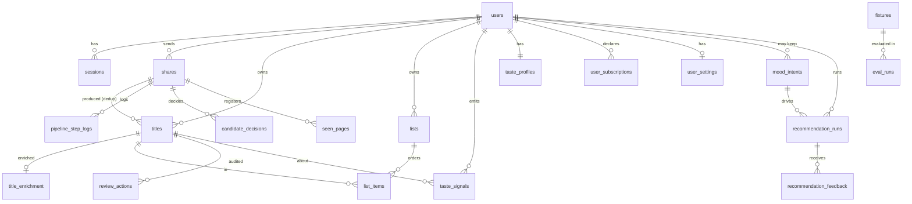
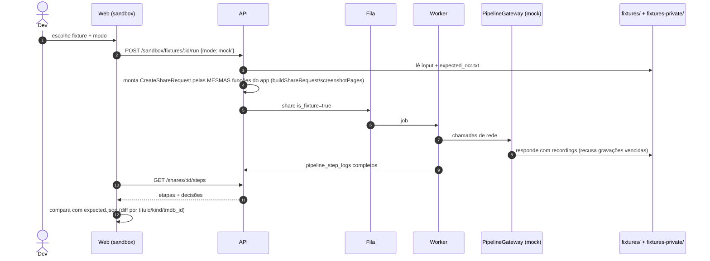

# Arquitetura v2

Delta sobre a arquitetura da Fase 1 (ver `CLAUDE.md` e `docs/spec/delta-v2.md` §1). Os nomes do prompt equivalem aos atuais assim: `apps/worker` = `apps/api/src/worker.ts`; `packages/shared` = `packages/contracts`.

## 1. Monorepo

| Pacote | Estado | Papel na v2 |
|---|---|---|
| `packages/contracts` | existe | Ganha os schemas `Library*`, `List*`, `PipelineStep`, `MoodIntent`, `Recommend*`, `TasteProfile`, `Feedback` e `Fixture`. Continua sendo a fonte única dos formatos. |
| `packages/taxonomy` | **novo** | Taxonomia v1 versionada (`docs/spec/taxonomy-v1.md` em código): gêneros, subgêneros, intenções, sinais de risco. Pura, sem I/O, testável. É usada pela API (ranking, `rules`, RNF-07) e pelas UIs (rótulos). |
| `apps/api` | existe | Módulos novos: `library`, `lists`, `review`, `recommend`, `profile`, `sandbox` (só fora de produção). Worker: processor de share instrumentado (RF-19) e jobs `enrich_title`, `rebuild_profile`. |
| `apps/mobile` | existe | Home com 3 modos (RF-31..33), detalhe de título com status e feedback, simulador de share (dev), suporte a Expo web (RF-17). |
| `apps/web` | **novo** | Sistema de organização (RF-24..30) e sandbox/inspector (RF-19, RF-22). |
| `fixtures/` | **novo** | Só fixtures sintéticas versionadas (C-V2-03). |
| `fixtures-private/` | **novo, gitignored** | Prints reais e gravações do modo `record`. |
| `tools/eval` | **novo** | CLI `pnpm eval` (RF-22). Reusa o pipeline da API em modo `mock`. |

## 2. Framework do `apps/web`

| Critério | Next.js (App Router) | Expo web (mesmo código do app) | Vite + React SPA |
|---|---|---|---|
| Tabelas densas, drag-and-drop, atalhos | Bom (ecossistema React web) | Fraco: RN-web não é feito para tabelas/DnD desktop | Bom (mesmo ecossistema do Next) |
| Reuso de código | Contratos | Telas e cliente do app (RF-17 já usa) | Contratos |
| SSR/SEO | Sim, mas desnecessário (app autenticado, 1 usuário) | Não | Não (não precisa) |
| Backend próprio | Tentação de colocar lógica em route handlers/server actions (viola RF-30) | Não | Nenhum: só consome a API |
| Auth com a API | BFF possível (cookie no domínio do Next), mas duplica sessão | Bearer como no app | Cookie httpOnly direto da API (§4) |
| Deploy | Vercel/Railway; runtime Node | Estático | Estático (qualquer CDN/Railway) |
| Complexidade | Média/alta | Baixa, com UX ruim no desktop | Baixa |

**Recomendação: Vite + React SPA** (React Router + TanStack Query + TanStack Table + dnd-kit), consumindo só a API. Motivos:
- RF-30 proíbe lógica no front, então o servidor do Next não traria ganho.
- Um SPA estático é o menor custo operacional.
- A UX de desktop que o Expo web não entrega.

**O Expo web fica só para o RF-17** (preview das telas do app). Revisitar o Next.js se houver página pública ou SEO.

## 3. Componentes e fluxos

| Componente | Responsabilidade | Novos pontos |
|---|---|---|
| API HTTP | Auth, CRUD de catálogo/listas/perfil, `POST /recommend` (síncrono, ≤ 1 chamada LLM), leitura de logs | CORS com credenciais só para `WEB_ORIGIN`; rotas `/sandbox/*` registradas só com `SANDBOX_ENABLED=true` e `NODE_ENV≠production` |
| Worker | Processamento de share (existente) + `enrich_title` (TMDB: gêneros, keywords, runtime, providers BR) + `rebuild_profile` | Cada etapa grava `pipeline_step_logs` |
| `PipelineGateway` | Porta única para rede no pipeline (oEmbed, TMDB, Spotify, LLM) | Implementações `live`/`mock`/`record` escolhidas por `PIPELINE_MODE` |
| `IntentInterpreter` | Texto → `MoodIntent` | `RulesInterpreter` (local, padrão) e `AnthropicInterpreter` (D-06, modelo pequeno, schema estrito). O detector de risco roda antes dos dois |
| `CandidateGenerator` | Catálogo do usuário + (opcional) TMDB discover/keywords/similar | Externo só com chave e dentro das regras ARB-REQ-02 |
| `Ranker` | Score determinístico: intenção × afinidade × disponibilidade × prioridade − penalidades (vistos, pulados, repetidos) | Pesos versionados em `taxonomy` |
| `Explainer` | `reason` por template a partir dos fatores | Sem LLM |

### 3.1 `PIPELINE_MODE` (RF-20)

| Modo | Rede | Fonte das respostas | Escreve | Permitido em |
|---|---|---|---|---|
| `mock` | Nenhuma: o gateway lança erro se algo tentar | `fixtures/**/recordings/*.json` e `fixtures-private/**/recordings/*.json` | — | dev, CI, sandbox |
| `live` | Sim (allowlist do `safeFetch`) | APIs reais | — | todos |
| `record` | Sim | APIs reais | `fixtures-private/<fixture>/recordings/` com `recorded_at` e hash da requisição | só dev (env valida `NODE_ENV≠production`) |

- Chave da gravação: `sha256(método + URL sem credenciais + corpo normalizado)`. Credenciais nunca são gravadas (SEC-REQ-14).
- No `mock`, gravações vencidas são recusadas: TMDB > 180 dias (TOS-REQ-02), YouTube > 30 dias (TOS-REQ-05).

### 3.2 Simulador reusando o ponto de entrada real (RF-18)

| Camada | Share real | Simulador |
|---|---|---|
| Entrada | `useShareIntent` (expo-share-intent) | Tela `/dev/share`: URL, texto, arquivo ou fixture |
| Normalização no device | `src/share/buildShareRequest.ts` + `screenshotPages.ts` + `ocr.ts` | **Mesmas funções**. O simulador monta um objeto `ShareIntent` no formato do plugin e chama o mesmo handler. No web, `ocr.ts` usa um adapter que lê `expected_ocr.txt` da fixture |
| Envio | `POST /shares` | `POST /shares` (idêntico), com cabeçalho `X-Fruiqo-Fixture: <id>` só fora de produção, para marcar `is_fixture` |
| Processamento | Worker | Worker (mesmo código), com `PIPELINE_MODE` do ambiente |

## 4. Autenticação do web (RF-30)

| Opção | Prós | Contras |
|---|---|---|
| Bearer (como o app), refresh em `localStorage` | Zero mudança na API | Refresh de longa duração exposto a XSS; contraria SEC-REQ-08 no espírito |
| **Refresh em cookie `httpOnly` + access em memória** | Refresh fora do alcance do JS; mesma rotação/reuso já implementados | Precisa de CORS com credenciais e defesa contra CSRF na rota de refresh |
| BFF (Next.js) | Isola tokens no servidor | Mais uma peça; tende a acumular lógica (RF-30) |

**Decisão proposta: cookie.**
- `POST /auth/login` e `/auth/register` aceitam `client: 'web'`:
  - a resposta traz só `accessToken` + `expiresIn`;
  - o refresh vai em `Set-Cookie: fruiqo_rt=…; HttpOnly; Secure; SameSite=Strict; Path=/auth; Max-Age=…`.
- `POST /auth/refresh` lê o cookie quando não há corpo e exige o cabeçalho `X-Fruiqo-Client: web` (proteção CSRF por cabeçalho customizado + SameSite=Strict).
- CORS: `origin = WEB_ORIGIN` (lista fechada), `credentials: true`.
- Logout apaga o cookie.
- O app mobile continua com bearer e refresh no secure-store.
- `TokenPair.refreshToken` passa a ser opcional no contrato.

## 5. Modelo de dados

Convenções:
- Toda tabela nova com `user_id` tem **RLS FORCE** com a policy `app_current_user()` (padrão da `0001_rls.sql`) e acesso via `withUser()` (SEC-REQ-16).
- Tabelas globais (sem `user_id`) são só leitura para `fruiqo_app`.

### 5.1 Alterações em entidades existentes

| Entidade | Alteração | Motivo |
|---|---|---|
| `recommendations` → **`titles`** (rename lógico; a tabela física pode manter o nome com view) | + `status` (`to_watch`/`watching`/`watched`/`dropped`), `priority` (0–3), `rating` (1–5, null), `notes`, `genres_override` (text[]), `tmdb_id`, `tmdb_type`, `enrichment` (`none`/`tmdb`/`demo`), `enriched_at`, `decision` (`cataloged`/`review_queue`/`discarded`), `decision_reason` | Catálogo (RF-24/25), fila de revisão (RF-28), ranking (RF-31..39). Continua com índice único `(user_id, dedup_key)` |
| `shares` | + `is_fixture` (bool), `fixture_id` (text, null) | Sandbox (RF-18/19) |

### 5.2 Entidades novas

| Entidade | Campos principais | Chaves/índices | Retenção |
|---|---|---|---|
| `pipeline_step_logs` | `id`, `user_id`, `share_id`, `step`, `seq`, `started_at`, `duration_ms`, `input_summary`, `output_summary` (jsonb, truncado), `tokens_in`, `tokens_out`, `cost_estimate_usd`, `error`, `mode` | `(share_id, seq)` | Resumos com texto de terceiros são apagados com o texto bruto, exceto `is_fixture` |
| `candidate_decisions` | `id`, `user_id`, `share_id`, `title_id` (null), `raw_title`, `confidence_score`, `decision`, `reason` | `(share_id)` | Com o share |
| `review_actions` | `id`, `user_id`, `title_id`, `action` (`approve`/`reject`/`edit`/`rematch`/`merge`), `before`, `after`, `created_at` | `(user_id, created_at)` | Indefinida (auditoria do próprio usuário) |
| `lists` | `id`, `user_id`, `name`, `origin` (`manual`/`share`), `source_share_id`, `pinned`, `created_at` | `(user_id, pinned)` | — |
| `list_items` | `list_id`, `title_id`, `position` | PK `(list_id, title_id)`; `(list_id, position)` | Cascade com lista/título |
| `title_enrichment` | `title_id`, `genres` (text[], vocabulário v1), `tmdb_genre_ids`, `keywords` (text[]), `runtime_min`, `overview`, `poster_url`, `providers_br` (jsonb), `fetched_at` | PK `title_id` | **≤ 180 dias** (TOS-REQ-02), purge existente estendido |
| `user_subscriptions` | `user_id`, `provider_key`, `created_at` | PK `(user_id, provider_key)` | — |
| `taste_signals` | `id`, `user_id`, `title_id` (null), `signal` (`watched`/`rated`/`skipped`/`removed`/`added_to_list`/`feedback`/`manual_override`), `value` (real), `reason_tag`, `created_at` | `(user_id, created_at)` | Indefinida, apagável pelo usuário |
| `taste_profiles` | `user_id`, `version`, `affinities` (jsonb: `{facet, key, score, pinned, excluded, top_signals[]}`), `updated_at` | PK `user_id` | — |
| `mood_intents` | `id`, `user_id`, `need`, `avoid` (text[]), `tone` (text[]), `energy`, `kinds`, `max_runtime_min`, `interpreter` (`rules`/`anthropic`), `created_at` | `(user_id, created_at)` | Só se "lembrar meu humor" = ON; senão TTL 0 (apagado ao fim do run). **Nunca o texto livre** (RNF-06) |
| `recommendation_runs` | `id`, `user_id`, `mode` (`continue`/`surprise`/`mood`), `input` (jsonb estruturado), `mood_intent_id`, `candidates` (jsonb: `title_ref`, `source`, `factors`, `score`), `result` (jsonb), `interpreter_model`, `tokens_in/out`, `cost_estimate_usd`, `risk_shown` (bool), `created_at` | `(user_id, created_at)` | 90 dias |
| `recommendation_feedback` | `id`, `user_id`, `run_id`, `title_ref`, `action` (`accept`/`skip`/`another`), `reason_tag`, `created_at` | `(run_id)` | Vira `taste_signal`; a linha segue a retenção do run |
| `user_settings` | `user_id`, `mood_opt_in_at`, `remember_mood` (bool), `ai_mode_override` | PK `user_id` | — |
| `fixtures` (global, sem RLS) | `id`, `kind`, `synthetic`, `path`, `expected` (jsonb), `version` | PK `id` | Espelha `fixtures/` |
| `eval_runs` (global, sem RLS; só dev) | `id`, `label`, `set`, `pipeline_mode`, `metrics` (jsonb), `per_fixture` (jsonb), `git_sha`, `created_at` | PK `id` | Só em dev/CI |

### 5.3 ER



## 6. Endpoints novos ou alterados

| Método | Rota | Request (resumo) | Response (resumo) | Consumidor |
|---|---|---|---|---|
| POST | `/auth/login`, `/auth/register` | + `client?: 'mobile'\|'web'` | web: sem `refreshToken` no corpo, com cookie | web |
| POST | `/auth/refresh` | corpo `{refreshToken}` **ou** cookie + `X-Fruiqo-Client: web` | `TokenPair` | web, app |
| GET | `/shares/:id/steps` | — | `PipelineStep[]` + `CandidateDecision[]` | web, sandbox |
| GET | `/library` | `kind, status, priority, genre, subgenre, listId, source, q, sort, cursor` | `{items: Title[], nextCursor}` | web, app |
| GET/PATCH/DELETE | `/library/:id` | PATCH: `title, kind, year, creator, status, priority, rating, notes, genresOverride` | `Title`; 409 com `conflictWith` se a nova `dedup_key` colidir | web, app |
| POST | `/library` | `{title, kind, year?, creator?}` (adição manual) | `Title` | web |
| POST | `/library/bulk` | `{ids[], action, payload}` | `{updated, undoToken}` | web |
| POST | `/library/bulk/undo` | `{undoToken}` | `{restored}` | web |
| POST | `/library/:id/merge` | `{intoId}` | `Title` (destino) | web |
| POST | `/library/:id/rematch` | `{provider, externalId}` ou `{query}` | `Title` ou candidatos | web (DEPENDE DA FASE 0 para busca TMDB sem chave) |
| GET | `/review` | `cursor` | `Title[]` com `decision = review_queue` | web |
| POST | `/review/:id` | `{action: approve\|reject\|edit\|rematch, payload?}` | `Title` | web |
| GET/POST | `/lists` | POST `{name}` | `List[]` / `List` | web, app |
| GET/PATCH/DELETE | `/lists/:id` | PATCH `{name?, pinned?}` | `ListDetail` | web, app |
| PUT | `/lists/:id/items` | `{titleIds[]}` (ordem completa) | `ListDetail` | web |
| POST | `/lists/:id/duplicate` | `{name?}` | `List` | web |
| GET | `/home` | — | `{continue?: {list, next, progress}, presets[], moodEnabled}` | app |
| POST | `/recommend` | `{mode: 'continue'}` \| `{mode: 'surprise', subgenre}` \| `{mode: 'mood', text}` + `{kinds?, source?: 'library'\|'all'}` | `{runId, riskSupport?: {cvv:…}, intent?, suggestions: [{title\|external, source, reason, availability}]}` | app, web |
| POST | `/recommend/:runId/feedback` | `{titleRef, action, reasonTag?, reasonText?≤30}` | `{next?: Suggestion}` | app, web |
| GET | `/profile/taste` | — | `TasteProfile` com `top_signals` | web, app |
| PATCH | `/profile/taste` | `{facet, key, pinned?, excluded?, reset?}` | `TasteProfile` | web |
| POST | `/profile/rebuild` | — | `TasteProfile` | web |
| GET/PUT | `/profile/subscriptions` | `{providers[]}` | `providers[]` | web, app |
| GET/PATCH | `/profile/settings` | `{moodOptIn?, rememberMood?}` | `UserSettings` | app, web |
| DELETE | `/profile/mood-history` | — | 204 | app, web |
| GET | `/sandbox/fixtures` | — | `Fixture[]` | web (dev) |
| POST | `/sandbox/fixtures/:id/run` | `{mode?: 'mock'\|'live'}` | `{shareId}` | web (dev) |
| GET/POST | `/sandbox/evals` | POST `{set, label}` | `EvalRun` | web (dev), CLI |

## 7. Sequências

### 7.1 Share → catálogo

```mermaid
sequenceDiagram
  autonumber
  actor U as Usuário
  participant App as App (device)
  participant API
  participant Q as Fila (BullMQ)
  participant W as Worker
  participant G as PipelineGateway
  participant DB as Postgres (RLS)
  U->>App: compartilha link/prints
  App->>App: OCR on-device (prints) / extrai URL (TOS-REQ-21)
  App->>API: POST /shares {clientShareId, text|url|pages}
  API->>DB: withUser: insert share (idempotente)
  API->>Q: job {shareId, userId}
  API-->>App: 201 Share(queued)
  Q->>W: job
  W->>DB: withUser: status=processing
  W->>W: normalize → noise_filter → merge_pages (log por etapa)
  W->>G: oEmbed oficial (só link; ARB-REQ-01)
  W->>W: extract (heurística; LLM só com D-04 liberado)
  W->>DB: dedup (seen_pages + unique dedup_key)
  W->>G: resolve TMDB/Spotify (se chave)
  W->>W: decide: cataloged | review_queue | discarded
  W->>DB: titles + candidate_decisions + pipeline_step_logs; lista automática (≥ 2 itens)
  W->>Q: enrich_title (TMDB gêneros/keywords/providers BR)
  App->>API: GET /shares/:id (polling)
  API-->>App: Share(done) + dedup
```

### 7.2 "Como estou" → sugestão (com desvio RNF-07)

```mermaid
sequenceDiagram
  autonumber
  actor U as Usuário
  participant App
  participant API
  participant R as RiskDetector (local)
  participant I as IntentInterpreter
  participant LLM as Anthropic (D-06, opcional)
  participant C as Candidates+Ranker
  participant DB as Postgres (RLS)
  U->>App: "estou triste, sofrendo por amor"
  App->>API: POST /recommend {mode:'mood', text}
  API->>DB: verifica mood_opt_in (RNF-06)
  API->>R: detectar risco (taxonomia §5)
  alt risco detectado
    API->>DB: recommendation_run(risk_shown=true, sem texto)
    API-->>App: riskSupport {CVV 188, cvv.org.br, SAMU 192}
    App-->>U: mensagem acolhedora; "quero continuar" depois
  else sem risco
    alt AI_MODE=anthropic
      API->>LLM: texto delimitado, sem tools, schema MoodIntent (sem dados TMDB)
      LLM-->>API: intent (+ risk_flag)
      API->>API: valida schema; inválido → rules; risk_flag → ramo de risco
    else AI_MODE=rules|off
      API->>I: RulesInterpreter (local)
    end
    API->>C: candidatos (catálogo → TMDB discover se necessário) + ranking determinístico
    C-->>API: top N + fatores
    API->>API: Explainer (template local)
    API->>DB: recommendation_run (input estruturado); mood_intent só se remember_mood
    API-->>App: sugestões + reason + disponibilidade
    U->>App: aceitar / pular / outra coisa ("pesado demais")
    App->>API: POST /recommend/:runId/feedback
    API->>DB: taste_signal + atualização incremental do perfil
  end
  Note over API: o texto livre é descartado ao fim da requisição (não vai a log, fila nem DB)
```

### 7.3 Execução de fixture no sandbox



## 8. Segurança (delta)

| Tema | Controle | Referência |
|---|---|---|
| CSRF no refresh via cookie | `SameSite=Strict` + cabeçalho customizado + `Path=/auth` + CORS fechado | SEC-REQ-07 (espírito), novo SEC-CTRL no threat model (F-11) |
| Sandbox em produção | Rotas `/sandbox/*` e cabeçalho `X-Fruiqo-Fixture` desativados por env; teste que sobe com `NODE_ENV=production` e espera 404 | — |
| Texto de humor | Não vai a log, fila nem DB; redaction do pino inclui `text` em `/recommend` | RNF-06, SEC-REQ-14 |
| Prompt injection (humor) | Sem tools, schema estrito, fallback `rules`, `message` sanitizada | RNF-08, SEC-REQ-04/05 |
| Custo | Quota diária de `/recommend` com LLM + throttling | SEC-REQ-06, RNF-09 |
| LLM × TMDB | Tipo `LlmSafeInput` que só aceita `{title, year}` do usuário e texto de humor; teste de arquitetura falha se `title_enrichment` for importado no interpretador/tagger | ARB-REQ-02 |
